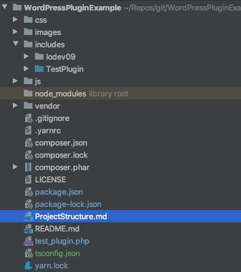

# TestPlugin - A WordPress Plugin Example
 > An example plugin for WordPress, using good practices and [Composer](https://getcomposer.org/).

<p float="left">
  
  
  
  
</p>



# Features
 - An object oriented plugin design
 - Takes advantage of PHP7 hinting (some areas don't use it, but can easily be added)
 - Helpers for connecting to a PDO capable database
 - Helpers for loading .ini, .json, .js, .css, and various other file handling
 - Hooks and actions that this plugin can hook to **AND** provide for **OTHER** plugins to hook 
 - A rudimentary ORM using a base class and common column/field naming in a class
 - A SQL loading class, for handling SQL files
 - A rudimentary template system, with an implicit data loading PHP for each page
 - Management of plugin generated pages, CSS, JS, dependencies on other WordPress plugins, and plugin integrity checks
 - **STRONGLY** uses the WordPress lifecycle for plugin operations
 - Adds support for [SRI](https://developer.mozilla.org/en-US/docs/Web/Security/Subresource_Integrity) for JS / CSS that WordPress doesn't support natively (as far as I can tell)
 - Includes Helpers for AWS S3 and RDS usage
 - A class for managing WordPress options for this plugin
 - Organization for AJAX endpoints, data structures, and easy way to generate responses with/without a nonce
 - A utility functions class with various helpful functions
 - A TypeScript JavaScript module for the plugin
 - Setup for RequireJS module loader
 - Includes an object-oriented jQuery widget module, for easy widget creation
 - Includes a JavaScript TestPlugin module, separated into smaller modules for good organization
 - Uses `yarn` Node package manager (improves upon NPM)

# Project Structure
You can find a document with the project structure [here](./ProjectStructure.md).

## Notes
* WordPress will always load the entrance file for this plugin whenever this plugin has a "context" (showing in the plugins menu, installing, activating, admin menus, pages, etc)
* Due to the above, the "require" directive for the composer autoloader will always be present for any file of the plugin (assuming normal WordPress lifecycle of course)
* When adding dependencies using composer, make sure to call ```composer dump-autoload``` to refresh the autoloader
* When adding your own files, ensure PHP files are named EXACTLY as the class name, or the autoloader won't find the class file
* Add namespaces in **composer.json** for directories / new files you want to include in the plugin
* You can optimize the autoloader and force it to build a classmap and only use a classmap for loading of class files
